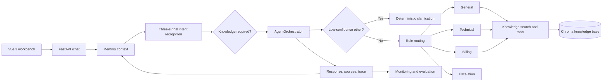

# CustomerOps

[中文说明](README.zh-CN.md)

CustomerOps is a customer-operations copilot built around a routed, retrieval-grounded multi-agent runtime. Rather than treating every support question as generic chat, it identifies the request, decides whether business knowledge is required, routes it to a suitable role, and preserves evidence for failure diagnosis.

The repository contains a Python/FastAPI backend and a Vue/Vite workbench. It is an engineering project and local demonstration environment, not a production help-desk replacement or a system that performs real refunds, account changes, or ticket creation.

## What is included

- 18 customer-operations intents, including order, logistics, refund, invoice, payment, account-security, login, crash, complaint, and human-handoff cases;
- three-signal intent recognition: LLM understanding, embedding similarity, and deterministic patterns, with an explicit low-confidence clarification path;
- General, Technical, Billing, and Escalation roles, with role-specific prompts, tool allowlists, and collaboration only for explicit cross-domain requests;
- ChromaDB-backed retrieval with query rewriting, deduplication, conditional reranking, and observable fallback behavior;
- Redis working memory plus Chroma episodic memory and user-profile storage;
- dynamically loaded Skills for general customer service, technical support, and billing support;
- a Vue workbench for chat, health checks, and knowledge-base operations;
- evaluation and tracing utilities for separating failures in intent recognition, routing, retrieval, tool execution, and final-answer coverage.

The project intentionally does **not** connect to a real order system, payment provider, CRM, or ticketing platform. Its current business tools are controlled demonstration handlers; high-risk actions remain outside the runtime boundary.

## Core architecture and request flow



The main path is: **Vue workbench → FastAPI → memory context → intent decision → knowledge gate → Agent orchestration → grounded response → memory and trace**.

| Layer | Main modules | Responsibility |
|---|---|---|
| Interaction | `frontend/src/App.vue`, `frontend/src/lib/backends.js` | Chat workbench, health state, knowledge-base UI, API adaptation |
| API | `backend/api/main.py` | Application lifecycle, HTTP endpoints, request/response models, knowledge gate |
| Intent | `backend/core/intent_recognizer.py` | Intent fusion, entity extraction, urgency, explicit compound requests |
| Orchestration | `backend/agents/agent_orchestrator.py` | Agent selection, collaboration, forced retrieval, tool boundaries, answer composition |
| Skills | `backend/core/skill_loader.py`, `backend/skills/` | Role-oriented process guidance injected into prompts |
| Knowledge and tools | `backend/mcp/knowledge_base.py`, `backend/mcp/tool_manager.py` | Retrieval, query rewrite, reranking, cache, circuit breaker, tool traces |
| Memory | `backend/memory/conversation_memory.py` | Redis working memory, Chroma episodic memory, user profiles |
| Observability | `backend/monitor/`, `backend/evaluation/` | Runtime signals, traces, evaluation helpers, failure diagnosis |

### Runtime decisions

1. **Build context** — retrieve recent conversation, relevant episodic memory, and an optional user profile.
2. **Recognize intent** — merge LLM, embedding, and pattern signals; extract entities and urgency; preserve only explicit cross-domain secondary intents.
3. **Clarify or route** — an `other` intent with a non-trivial message and confidence below `0.5` receives a deterministic clarification question before Agent or RAG execution.
4. **Retrieve when required** — business intents activate a knowledge gate. Retrieval uses the original query plus up to three LLM-generated rewrites, stable deduplication, and reranking only when there are more candidates than the requested Top-K.
5. **Respond within role boundaries** — the selected Agent receives the relevant Skill and only its allowed tools. The Escalation Agent creates a deterministic handoff summary; it does not create a real ticket.
6. **Record diagnostics** — routing, retrieval, tool, fallback, and latency signals make a bad result diagnosable instead of a generic “model failure.”

Two boundaries are deliberate: a Skill is prompt context rather than authorization, so each Agent's `get_tools()` allowlist enforces actual tool access; and a specialist Agent fails visibly when required retrieval is unavailable, rather than inventing a business answer.

## Run locally

### Prerequisites

- Docker and Docker Compose for the quickest backend setup;
- Python 3.12 for local backend development;
- Node.js 22 for frontend development;
- an Anthropic-compatible model endpoint and API key.

### 1. Configure and start the backend

Create `backend/.env` from the repository root. Do not commit this file.

```env
ANTHROPIC_API_KEY=replace_with_your_key
# Optional when using an Anthropic-compatible provider
ANTHROPIC_BASE_URL=https://your-provider.example/anthropic
ANTHROPIC_MODEL=your-model-name
REDIS_PASSWORD=change-this-for-any-shared-environment
```

Start the backend stack:

```bash
cd backend
docker compose up -d --build
docker compose ps
```

The backend listens on `http://localhost:8000`. The stack also starts Redis, ChromaDB, Prometheus, and Nginx.

For local Python development, start Redis and ChromaDB with Compose first, then run:

```powershell
cd backend
python -m venv .venv
.\.venv\Scripts\Activate.ps1
python -m pip install -r requirements.txt
python api/main.py
```

Set `REDIS_URL`, `CHROMA_HOST`, and `CHROMA_PORT` when the defaults do not match your local services.

### 2. Start the frontend

In another terminal:

```bash
cd frontend
npm install
npm run dev
```

Open the Vite URL printed in the terminal (normally `http://localhost:5173`). The development proxy uses the `/api/python` prefix for the Python backend.

### 3. Check the service

| Endpoint | Purpose |
|---|---|
| `GET /health` | Health and initialized-component summary |
| `POST /chat` | Main customer-operations conversation endpoint |
| `GET /skills` | Loaded Skill summary |
| `GET /knowledge/stats` | Knowledge-base statistics |
| `POST /knowledge/add` / `POST /knowledge/upload` | Add knowledge |
| `GET /monitor` | Runtime monitoring summary |
| `GET /trace/tool/{request_id}` | Tool and retrieval trace for one request |
| `GET /docs` | FastAPI OpenAPI interface |

```bash
curl -X POST http://localhost:8000/chat \
  -H "Content-Type: application/json" \
  -d '{"user_id":"demo-user","conv_id":"demo-conversation","message":"When will my refund arrive?"}'
```

## Development and evaluation

Run backend tests from `backend/`:

```bash
python -m pytest
```

Evaluation is intended to localize a failure, not merely produce an aggregate score. A useful review separates intent/routing correctness, required knowledge coverage in Top-K retrieval, forced-retrieval and tool-boundary behavior, final-answer facts and actions, and fallback/latency/trace completeness.

Retrieval `score` values are derived from vector distance. They are useful for ranking and diagnosis, but are **not** answer probabilities or a substitute for labeled evaluation data. Any published metric should state its dataset, evaluation date, denominator, and failure-handling policy.

## Privacy, safety, and repository scope

- Do not commit model keys, `.env` files, production exports, customer messages, local Chroma/Redis data, logs, or generated runtime results.
- This repository is not a ready-made authorization or compliance layer. Production use requires organization-specific identity, permission, audit, retention, masking, and human-approval controls.
- Skills guide model behavior but do not grant privileges. High-risk operations must be protected by code-level tool allowlists and external policy checks.
- Public history should contain runnable product code, frontend source, deterministic configuration, tests, and only final evaluation assets needed for reproducibility. Intermediate benchmark drafts, internal workflow notes, diagnostic artifacts, and local databases should stay out of the repository.

## Current scope and next steps

CustomerOps demonstrates a modular single-process Agent application with external Redis, ChromaDB, and Prometheus services. It does not yet offer real CRM, payment, order, or ticket-system integrations.

Next steps:

1. replace demonstration handlers with audited adapters to real business systems;
2. add authentication, role-based access control, approval steps, and durable audit logs;
3. package a sanitized, reproducible public evaluation set and publish metrics with definitions;
4. add deployment profiles and automated quality checks for different environments.

## License

No license is currently declared for this repository. Add an explicit license before third-party reuse or redistribution.
