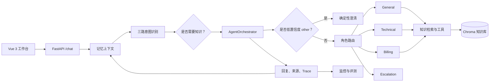

# CustomerOps

[English README](README.md)

CustomerOps 是一个面向客服与运营场景的多 Agent 协同中枢。它不把所有问题交给同一个通用聊天模型，而是先识别用户诉求、判断是否需要业务知识、路由给合适的角色，再留下足够的过程证据以便排查问题。

仓库包含 Python/FastAPI 后端和 Vue/Vite 工作台。它用于工程展示和本地演示，不是可直接替代生产客服系统的成品；当前不会真实执行退款、账户修改或工单创建等高风险业务动作。

## 当前包含的能力

- 覆盖订单、物流、退款、发票、支付、账户安全、登录、崩溃、投诉、转人工等 **18 类客服/运营意图**；
- 将 LLM 语义理解、Embedding 相似度和确定性 Pattern 融合，并为低置信度问题提供澄清路径；
- General、Technical、Billing、Escalation 四类角色；只有明确跨业务域的复合请求才触发多 Agent 协作；
- 基于 ChromaDB 的 RAG 知识检索，包含查询改写、去重、条件式 Rerank 和可观测降级；
- Redis 工作记忆，以及 Chroma 情景记忆和用户画像；
- 通用接待、技术支持、账单处理三类动态 Skill；
- 支持对话、健康检查和知识库操作的 Vue 工作台；
- 用于区分意图、路由、检索、工具执行与最终答案问题的 Trace 和评测工具。

项目刻意**没有**接入真实订单、支付、CRM 或工单系统。当前业务工具是受控的演示处理器；高风险动作不在本项目的运行边界内。

## 核心架构与请求链路



主链路为：**Vue 工作台 → FastAPI → 记忆上下文 → 意图决策 → 知识 Gate → Agent 编排 → 有依据的回复 → 记忆与 Trace**。

| 层级 | 核心模块 | 主要责任 |
|---|---|---|
| 交互层 | `frontend/src/App.vue`、`frontend/src/lib/backends.js` | 对话工作台、健康状态、知识库操作、API 适配 |
| API 层 | `backend/api/main.py` | 生命周期、HTTP 接口、请求响应模型、知识检索 Gate |
| 意图层 | `backend/core/intent_recognizer.py` | 意图融合、实体抽取、紧急度、显式复合请求 |
| 编排层 | `backend/agents/agent_orchestrator.py` | Agent 选择、协作、强制检索、工具边界、答案合并 |
| Skill 层 | `backend/core/skill_loader.py`、`backend/skills/` | 向模型注入按角色划分的流程与边界 |
| 知识与工具层 | `backend/mcp/knowledge_base.py`、`backend/mcp/tool_manager.py` | 检索、查询改写、Rerank、缓存、熔断、工具 Trace |
| 记忆层 | `backend/memory/conversation_memory.py` | Redis 工作记忆、Chroma 情景记忆、用户画像 |
| 可观测层 | `backend/monitor/`、`backend/evaluation/` | 运行信号、Trace、评测辅助与失败归因 |

### 运行时决策

1. **构建上下文**：读取近期对话、相关情景记忆和可选用户画像。
2. **识别意图**：融合 LLM、Embedding、Pattern 信号，抽取实体与紧急度；只保留明确跨域的次意图。
3. **澄清或路由**：当意图为 `other`、消息长度大于 2 且置信度低于 `0.5` 时，先返回确定性澄清问题，不进入 Agent 或 RAG。
4. **按需检索**：业务意图会打开知识 Gate。检索使用原问题和最多三条 LLM 查询改写，稳定去重；只有候选数大于 Top-K 时才执行 Rerank。
5. **在角色边界内回答**：被选中的 Agent 只会接收相关 Skill 和已允许工具。Escalation Agent 只生成确定性交接文本，不会创建真实工单。
6. **记录诊断信息**：路由、检索、工具、降级和耗时信息使失败可以被定位，而不是笼统归为“模型效果不好”。

这里有两个刻意保留的边界：Skill 是注入给模型的行为上下文，不是授权系统，因此工具权限必须由各 Agent 的 `get_tools()` 白名单强制控制；专属 Agent 在必需检索不可用时会显式失败，而不是编造业务答案。

## 本地运行完整应用

### 准备环境

- 推荐使用 Docker 与 Docker Compose 快速启动后端；
- 本地开发后端需要 Python 3.12；
- 本地开发前端需要 Node.js 22；
- 需要一个兼容 Anthropic 协议的模型服务与 API Key。

### 1. 配置并启动后端

在仓库根目录下创建 `backend/.env`。不要提交此文件。

```env
ANTHROPIC_API_KEY=替换为你的密钥
# 使用兼容 Anthropic 协议的服务时可选
ANTHROPIC_BASE_URL=https://your-provider.example/anthropic
ANTHROPIC_MODEL=your-model-name
REDIS_PASSWORD=共享环境中请修改此密码
```

启动后端服务栈：

```bash
cd backend
docker compose up -d --build
docker compose ps
```

后端默认监听 `http://localhost:8000`。该服务栈还会启动 Redis、ChromaDB、Prometheus 和 Nginx。

如果希望在本地直接运行 Python API，而不是运行后端应用容器，先用 Compose 启动 Redis 和 ChromaDB，再启动 API：

```powershell
cd backend
python -m venv .venv
.\.venv\Scripts\Activate.ps1
python -m pip install -r requirements.txt
python api/main.py
```

非容器环境下，如默认配置与你的服务地址不一致，请显式设置 `REDIS_URL`、`CHROMA_HOST` 与 `CHROMA_PORT`。

### 2. 启动前端

在另一个终端运行：

```bash
cd frontend
npm install
npm run dev
```

打开终端输出的 Vite 地址（通常为 `http://localhost:5173`）。开发代理使用 `/api/python` 前缀连接 Python 后端。

### 3. 检查服务

| 接口 | 用途 |
|---|---|
| `GET /health` | 服务健康状态与已初始化模块摘要 |
| `POST /chat` | 客服/运营对话主接口 |
| `GET /skills` | 当前加载的 Skill 摘要 |
| `GET /knowledge/stats` | 知识库统计 |
| `POST /knowledge/add` / `POST /knowledge/upload` | 添加知识 |
| `GET /monitor` | 运行监控摘要 |
| `GET /trace/tool/{request_id}` | 查询单次请求的工具与检索 Trace |
| `GET /docs` | FastAPI OpenAPI 页面 |

```bash
curl -X POST http://localhost:8000/chat \
  -H "Content-Type: application/json" \
  -d '{"user_id":"demo-user","conv_id":"demo-conversation","message":"退款什么时候到账？"}'
```

## 开发与评测

在 `backend/` 目录下运行测试：

```bash
python -m pytest
```

评测的目标不是只给出一个总分，而是定位链路中的具体失败层。一次有效复盘应至少区分：意图与路由是否正确、必要知识片段是否出现在检索 Top-K 中、强制 RAG 与工具权限边界是否生效、最终答案是否覆盖必答事实与必要动作，以及是否发生降级/超时、Trace 是否完整。

检索结果中的 `score` 由向量距离转换而来，适合用于排序和诊断；它**不是**回答正确率或严格概率，也不能代替人工标注的命中判断。若在 README 发布指标，应同时写清数据集、评测日期、分母与异常处理口径。

## 隐私、安全与仓库范围

- 不要提交模型密钥、`.env`、生产数据导出、客户对话、本地 Chroma/Redis 数据、日志或运行期结果。
- 本项目不默认提供可直接用于生产的鉴权、合规或权限系统。生产使用前需结合组织制度补齐身份认证、授权、审计留存、数据脱敏和人工审批。
- Skill 只指导模型行为，不赋予权限；高风险动作必须由代码级工具白名单和外部策略校验保护。
- 公开仓库应保留可运行的核心代码、前端源码、确定性配置、测试，以及复现所需的最终评测资产。评测过程稿、内部链路文档、临时诊断物、本地数据库和日志不应进入公开历史。

## 当前范围与下一步

CustomerOps 当前展示的是“单体应用 + Redis、ChromaDB、Prometheus 外部服务”的模块化 Agent 架构。它尚未提供真实 CRM、支付、订单或工单系统的集成。

后续可以优先推进：

1. 将演示处理器替换为经过审计的真实业务系统适配器；
2. 增加鉴权、角色权限、审批节点和可持久化的审计日志；
3. 提供脱敏、可复现的公开评测集，并随版本发布写清指标定义；
4. 增加面向不同环境的部署配置和自动化质量检查。
